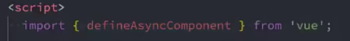
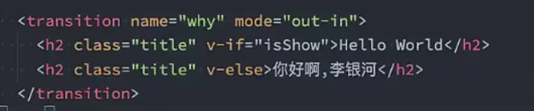
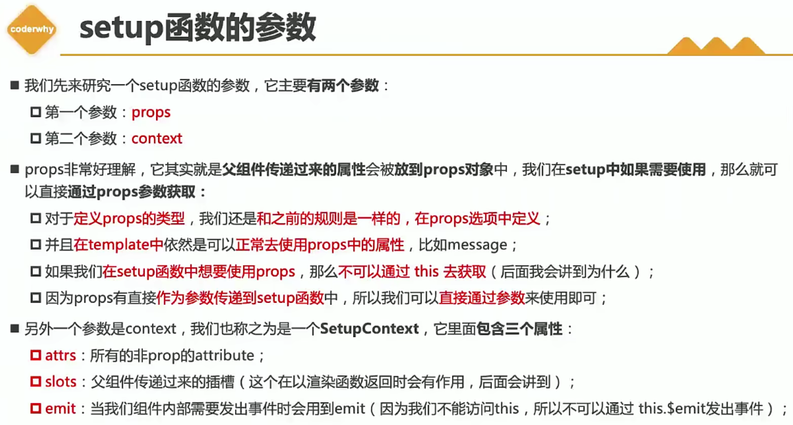
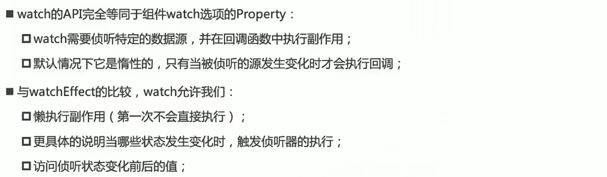
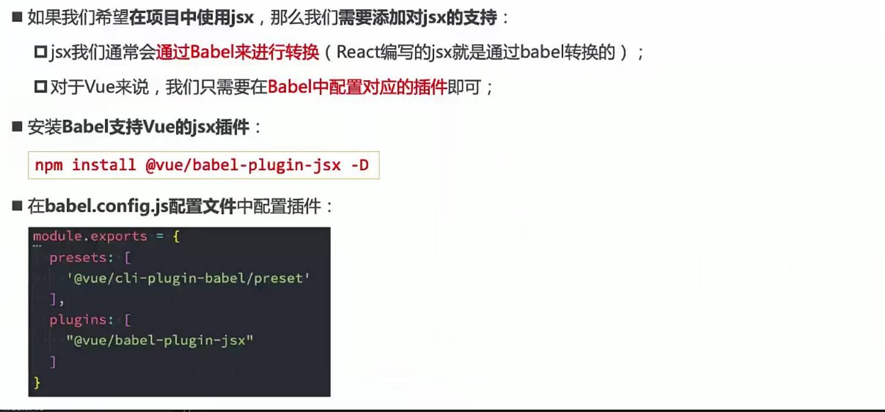

# webpack

# Babel

# Vue3

## emit

## webpack打包 异步组件

## 优化首屏渲染速度  分包

loadingComponent 占位组件  异步  很少用!!!

## v-model

计算属性实现

## 动画

### 单个

### 动画翻转

哪个时间长选哪个  主导属性

### 过渡的模式 mode

### gsap库

### 钩子    

### 多个

### 列表添加删除动画

### 列表交替动画

## options api   (vue2)

## composition api   (setup)

### set up 无 this

### computed

### watch相关

#### watchEffect

自动执行一次 用来拿到依赖    

停止侦听

清除副作用

#### watch

##### 侦听单个

情况一  方便取值

##### 侦听多个

##### 深度侦听

### ref

侦听操作在dom渲染完后执行

### 实验性特性 setup

不需要return

目前脚手架不支持

## 生命周期钩子

可以定义多个相同的生命周期函数 , 挂载前的操作可以放到setup中直接操作

## Provide

此时不是响应式

## usetitle

改变页面title的hook

使用:    

# h函数  (render)

# jsx

# 自定义指令

与2.0差别

# vue源码相关

## 为什么使用proxy

# vuerouter

## router-link

## 懒加载

打包时候会进行分包操作

## vue3

# TS

## any

## unknown

## void

## never

## 联合类型

默认返回 never

## 可选类型

## tuple 元组

多种元素的组合

## 函数重载

## !!和??

## 类的多态

## 接口

索引类型

函数类型

